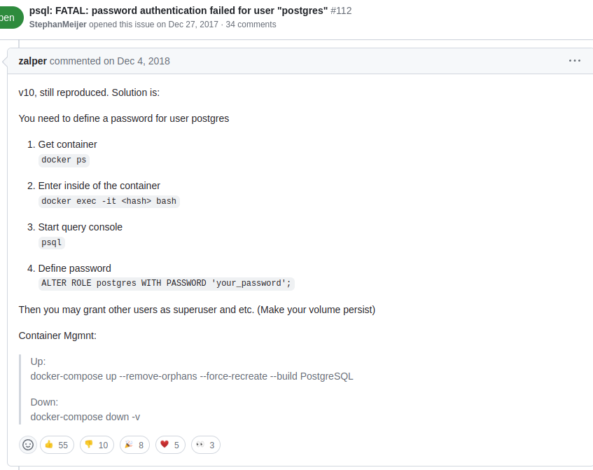
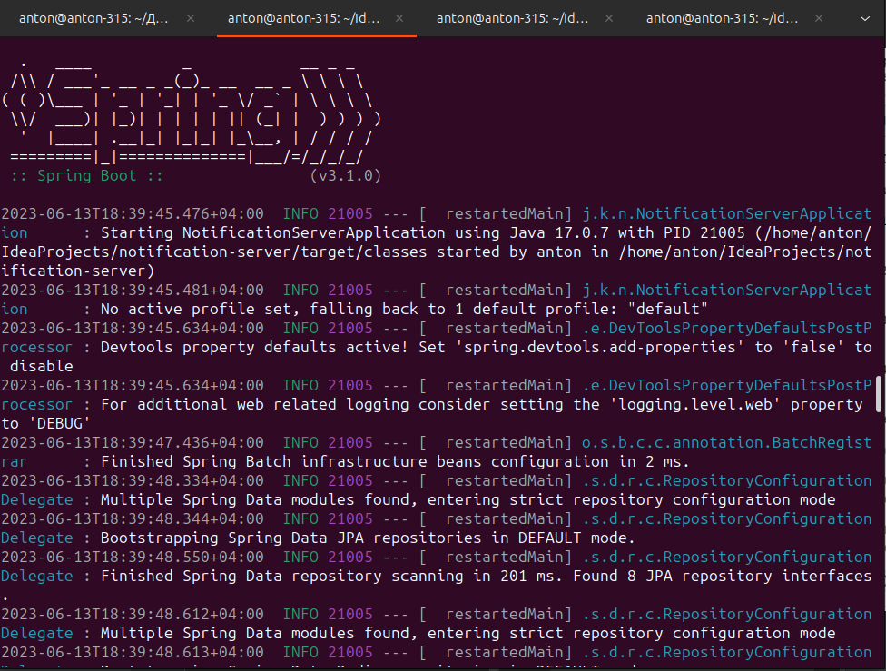

# Notificator


Notificator - это система, разработанная для оповещения людей или групп людей о важном событии или чрезвычайной ситуации. Каждый пользователь может зарегистрироваться в системе, импортировать свои контакты и разослать шаблонное сообщение. Кроме того, система содержит крон задачи, которые мониторят работоспособность сайтов, которые были добавлены пользователями. Notificator позволяет пользователям быстро и эффективно оповещать своих контактов о важных событиях и обеспечивает надежный механизм проверки работоспособности сайтов и сервисов в режиме реального времени.

[Youtube video with running](https://www.youtube.com/watch?v=7CCoSfbnGbk&t=305s) - https://www.youtube.com/watch?v=7CCoSfbnGbk&t=305s
<br>
<br>
[How does it working](https://www.youtube.com/watch?v=lbhYA82EiAU&t=2640s) - https://www.youtube.com/watch?v=lbhYA82EiAU&t=2640s

<br>

[Angular Client](https://github.com/AntonSibgatulin/notificator-client) - https://github.com/AntonSibgatulin/notificator-client

```
npm init -y
npm start
```


Notificator - это система, основанная на микросервисной архитектуре, и состоит из нескольких компонент: апи-сервера, микросервиса по рассылке писем, main controller микросервиса и крон-сервиса, который мониторит сайты пользователей. Архитектура микросервисов позволяет каждому компоненту системы быть независимым, иметь свою логику работы, свой API и базу данных. Система использует API-сервер для общения между компонентами и обеспечивает их совместную работу. Микросервис по рассылке писем отвечает за отправку сообщений через различные каналы, такие как SMS, электронная почта и т.д. Main controller микросервис обрабатывает запросы пользователя, обеспечивая логику работы системы. Крон-сервис позволяет мониторить работоспособность сайтов, которые указывают пользователи, и отправлять им оповещения в случае проблем. Таким образом, Notificator предоставляет надежную и эффективную систему оповещения людей о важных событиях или чрезвычайных ситуациях.


Микросервисная архитектура в Notificator соединена между собой через Kafka - это распределенная система потоков данных. Kafka позволяет каждому компоненту системы работать независимо друг от друга и обменяться данными через сообщения. Система использует Kafka для передачи сообщений между микросервисами, что обеспечивает более надежную и отказоустойчивую работу системы. Благодаря этому каждый компонент системы может работать в своем собственном темпе, обслуживая запросы пользователей и обработку данных. Кроме того, Kafka позволяет осуществлять масштабирование системы в зависимости от нагрузки и добавлять новые компоненты без влияния на работу других компонент. Таким образом, используя микросервисную архитектуру и связующее звено Kafka, Notificator предоставляет надежный, масштабируемый и гибкий инструмент для оповещения людей о важных событиях и чрезвычайных ситуациях.

# Информация о микросервисах

### [Cron-microservice](https://github.com/AntonSibgatulin/cron-microservice) - https://github.com/AntonSibgatulin/cron-microservice

### [Mailing-microservice](https://github.com/AntonSibgatulin/mailing-microservice) - https://github.com/AntonSibgatulin/mailing-microservice

### [Main-controller-microservice](https://github.com/AntonSibgatulin/main-controller-microservice) - https://github.com/AntonSibgatulin/main-controller-microservice

### [API Server](https://github.com/AntonSibgatulin/notification-server) - https://github.com/AntonSibgatulin/notification-server

#Информация о запуске

Вам потребцется:
 1. Apache Kafka (естественно вместе с zookeeper)
 2. MySQL DB Server
 3. PostgresSQL Server
 4. Redis
 
Для того,чтобы не заботится об этом,я написал docker-compose ,в котором все это есть!


1. ```
    git clone https://github.com/AntonSibgatulin/notification-server.git
    cd notification-server
    docker-compose up -d
    ```


2. ```
   docker-compose ps
   docker exec -it notification-server_postgres_1 bash
   psql -W notification
   pass: Dert869$$
   ALTER ROLE root WITH password 'Dert869$$';
   ```
    
3. ```
   mvn install 
   mvn package
   mvn spring-boot:run
   ```
   
 - API Server

4. ```
   git clone https://github.com/AntonSibgatulin/mailing-microservice.git
   cd mailing-microservice
   mvn exec:java -Dexec.mainClass="jp.konosuba.App"
   ```

 - Mailing service сервис по рассылке (В данный момент только email письма!)

Таких микросервисов вы можете запускать столько,сколько хотите

5. ```
   git clone https://github.com/AntonSibgatulin/main-controller-microservice
   cd main-controller-microservice
   mvn exec:java -Dexec.mainClass="jp.konosuba.App"
   ```


6. ```
   git clone https://github.com/AntonSibgatulin/cron-microservice.git
   cd cron-microservice
   mvn exec:java -Dexec.mainClass="ru.antonsibgatulin.App"
   ```
